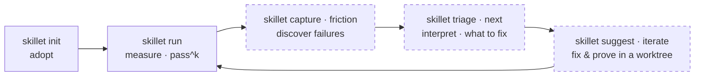

# 🍳 skillet — the SKILL.md Evaluation Toolkit

`skillet` is a public, open-source, multi-harness Swift CLI for [**eval-driven development (EDD)**](https://www.youtube.com/watch?v=v9FTCvkV_a0) of
agent skills: capture real runs, turn hand-fixes into structured evidence, and ship a `SKILL.md`
edit only after a previously-failing eval proves it.

Where autonomous skill *optimizers* (SkillOpt, EvoSkill) auto-accept or auto-commit their edits,
skillet drafts and proves — **a human lands every write**.

> **Status — Phase 1 (walking skeleton) COMPLETE.** F1 (project discovery & output contract),
> F2 (`skillet init`), F4 (`skillet lint`), F5 (trace & harness seam), F6 (claude-code adapter),
> F8 (frozen boundary codecs — the skill-creator formats round-trip faithfully), and
> F7 (`skillet run` — the neutral runner with `pass^k`) have landed, and Phase 2 is underway:
> F3 (`skillet doctor` — the free $0 preflight) shipped. The rest
> of the loop lights up across later phases. See [ROADMAP.md](ROADMAP.md).

## How it works

skillet runs a tight **eval-driven loop** — measure your skill, find where it fails, fix it, and
re-measure — and a `SKILL.md` edit ships only after its previously-failing eval passes. **Solid =
available today, dashed = planned** (see [ROADMAP.md](ROADMAP.md)):



You **adopt** skillet once (`init`), then loop: **measure** with `run` (each eval repeated *k* times
for a `pass^k` consistency score), **discover** real failures via `capture`/`friction`, **interpret**
them with `triage` — `next` names the single highest-value action — then **fix and prove** the change
with `suggest`/`iterate` in a throwaway worktree, and re-run. Free `lint` checks gate every paid
`run`, and `skillet doctor` preflights the whole environment for $0 — config, harness, skill
visibility — so a misconfig never costs money. Today `skillet init`, `skillet doctor`, `skillet lint`,
and `skillet run` ship (plus `skillet harness info` for setup); the rest lands across the
roadmap phases.

## Install

Requires **Swift 6** (tested on 6.3) on **macOS 14+** or current **Ubuntu LTS**.

```sh
git clone https://github.com/21-DOT-DEV/skillet
cd skillet
swift build                 # builds .build/debug/skillet
swift run skillet --help
```

## Usage

```sh
skillet                     # show the EDD loop overview
skillet --json              # machine-readable project context (schema: skillet.root/1)
skillet -C path/to/repo     # operate as if started in another directory
skillet init                # adopt skillet in the current repo (idempotent)
skillet init --json         # report created/skipped paths (schema: skillet.init/1)
skillet doctor [<skill>...] # free $0 preflight: config, harness, skill visibility, lint (exit 3 on failure)
skillet doctor --json       # machine-readable check rows (schema: skillet.doctor/1)
skillet lint                # free static analysis of SKILL.md (exit 1 on error-tier findings)
skillet lint --json         # machine-readable findings (schema: skillet.lint/1)
skillet run <skill>         # run the skill's evals k×, judge, report pass^k (paid; spend-gated)
skillet run <skill> -n      # dry-run: preview the trial-count estimate, spend nothing
skillet run --json          # machine-readable result (schema: skillet.run/1)
skillet run --json -n        # spend-free plan preview (schema: skillet.run-plan/1)
skillet harness info        # harness adapters, capabilities, probe status
skillet harness info --json # machine-readable (schema: skillet.harness-info/1)
```

Every command speaks to **humans** (TTY) and **scripts** (`--json`, each payload carrying a `schema`
field) and returns stable exit codes: `0` ok · `1` measured failure · `2` usage · `3` environment ·
`4` artifact · `5` gate. Human/TTY text is for people and is **not** an API; `--json` and exit codes
are the stable contract.

## Documentation

- [Testing skillet end-to-end](Sources/skillet/skillet.docc/TestingEndToEnd.md) — a hands-on walkthrough of `init` → `lint` → `run`, including a real claude-code run via the Zed-bundled binary (a DocC article in the `skillet` catalog).
- [AGENTS.md](AGENTS.md) — operational onboarding for humans and AI agents (commands, conventions, boundaries).
- [skillet-design.md](skillet-design.md) — the product design (principles, command surface, file formats).
- [ROADMAP.md](ROADMAP.md) + [Roadmap/](Roadmap/) — the phased plan.
- [Specs/](Specs/) — per-feature implementation plans.
- [.specify/memory/constitution.md](.specify/memory/constitution.md) — the development charter.

Contributing, security disclosure, and code of conduct are handled at the org level:
[`21-DOT-DEV/.github`](https://github.com/21-DOT-DEV/.github).

## License

[MIT](LICENSE).
